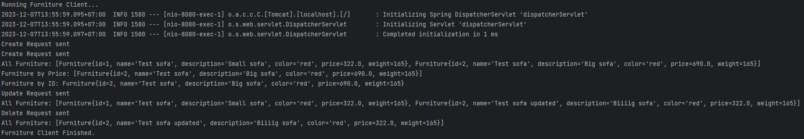

# Пр 7

Вариант 11: Мебель.

Модифицировалась 5 работа.

## Инструкция по запуску

Убедитесь в наличии на вашем устройстве [JDK](https://www.oracle.com/java/technologies/downloads/#jdk17-windows)

```
git clone https://github.com/infern397/RKIS-7.git
cd RKIS-7
psql -U postgres -c "CREATE DATABASE furniture_bd;"
sh mvnw package
java -jar target/mvc-0.0.1-SNAPSHOT.jar true
```
Открываем в браузере [главную страницу](http://127.0.0.1:8080)

_Для сборки необходим [Maven](https://maven.apache.org/download.cgi)_

_[Документация](https://documenter.getpostman.com/view/31418916/2s9YeLWoKH) по запросам в Postman_

Для реализации сервиса "клиент" был использован класс WebClient, а не RestTemplate, 
т.к. последний не поддерживает PATCH запросы.

Запуск клиента осуществляется через интерфейс CommandLineRunner, для запуска необходимо 
передать аргумент "true" при запуске.

Контроллер реализован с использованием аннотации @RestController.



Демонстрация работы клиента.